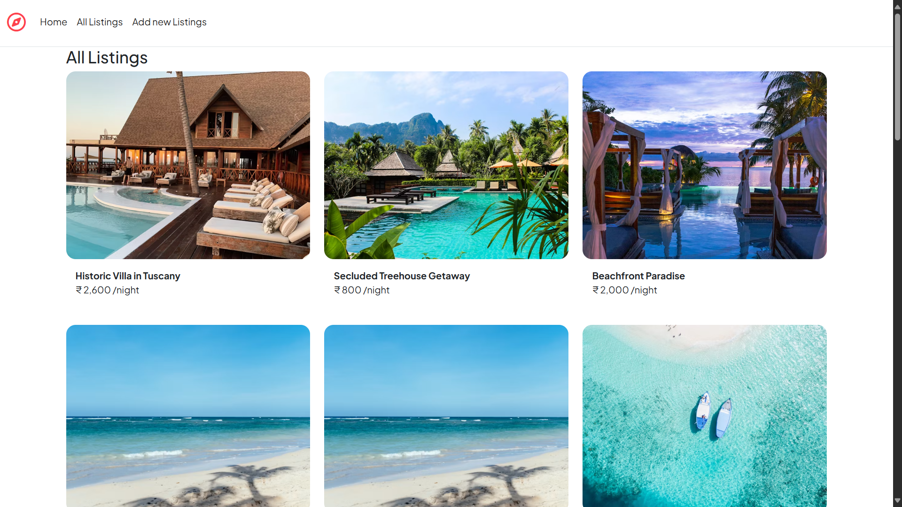
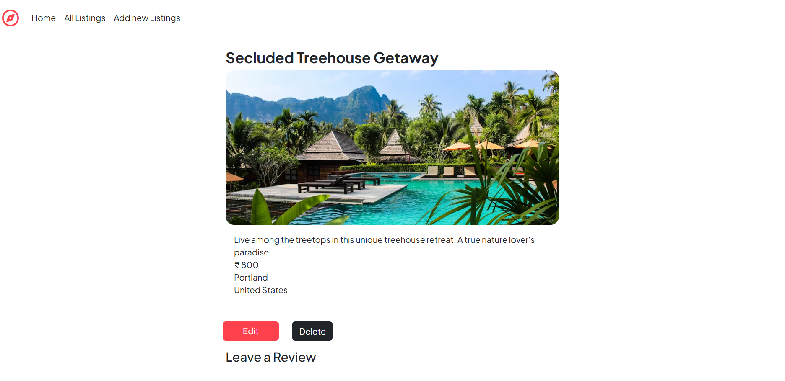
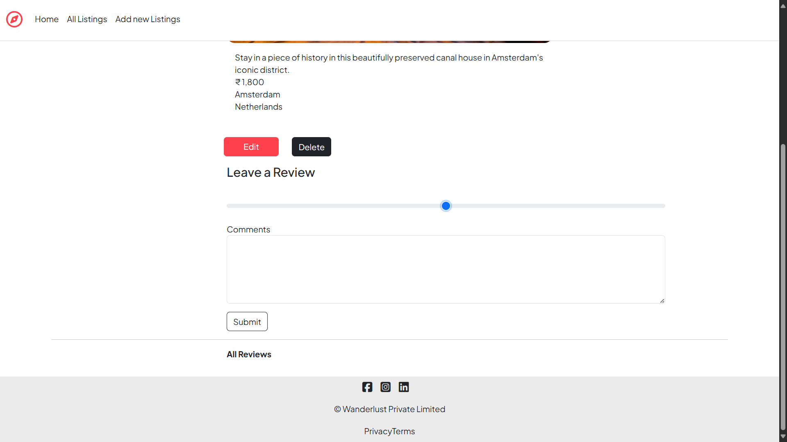
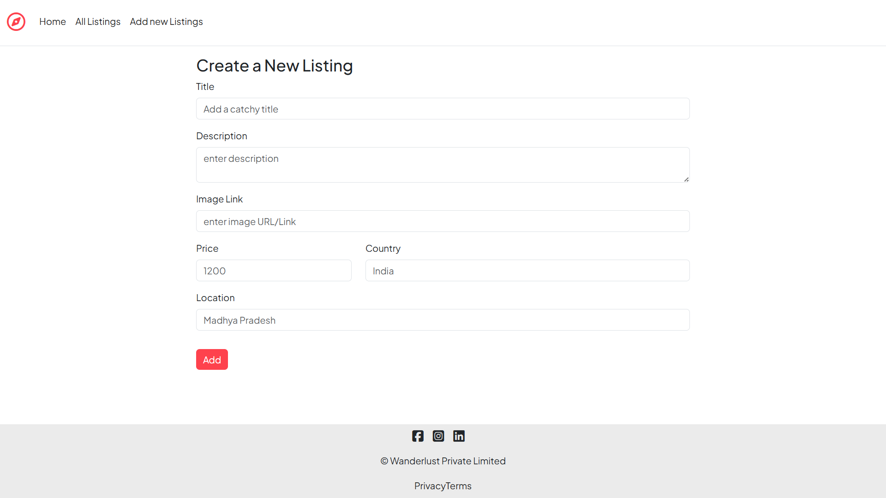
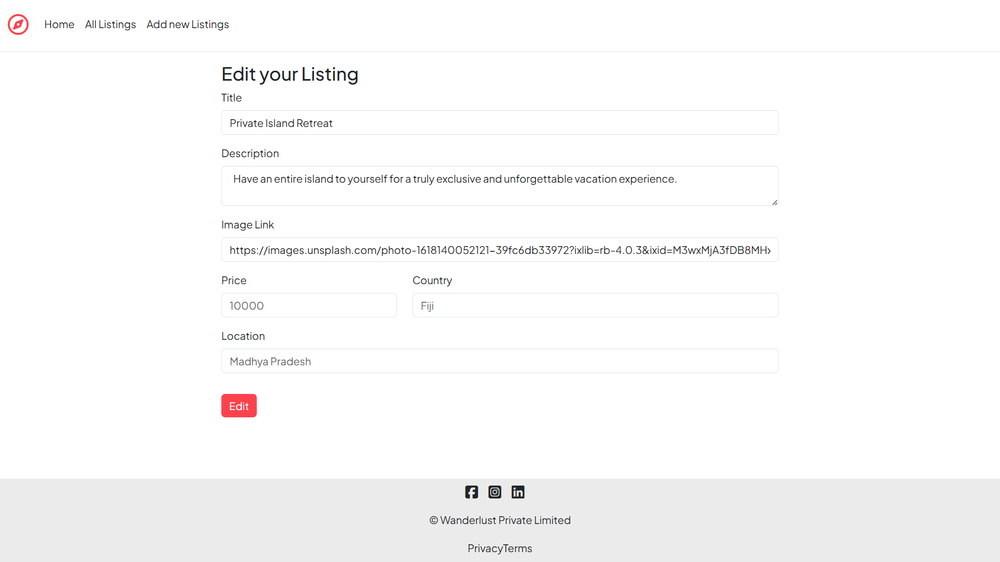

# 🌍 Wanderlust Hotels

**Wanderlust Hotels** is a full-stack hotel listing web application where users can explore hotel details like rent, location, and other features. Built using modern web technologies, the platform is ideal for travelers searching for comfortable stays.

---

## 🚀 Features

- 🏨 View detailed hotel listings (name, rent, location)
- 📁 Organized hotel data using MySQL and custom schemas
- 🌐 Dynamic rendering with custom-built APIs
- 💡 Responsive UI with HTML, CSS, JavaScript & Bootstrap
- 🧠 MVC architecture using Node.js, Express, and EJS views

---

## 🛠️ Tech Stack

### 🔹 Frontend
- HTML5, CSS3
- JavaScript
- Bootstrap 5
- EJS Templating Engine

### 🔹 Backend
- Node.js
- Express.js

### 🔹 Database
- MySQL (with custom schema setup in `schema.js`)

### 🔹 APIs
- Custom REST APIs built with Express

---

## 📁 Project Structure

```
Wanderlust-Hotels/
├── models/               # DB models/schemas
├── node_modules/         # Dependencies
├── public/               # Static files (CSS, JS, images)
├── utils/                # Helper functions/utilities
├── views/                # EJS templates for rendering
├── app.js                # Main server file
├── schema.js             # MySQL schema
├── package.json          # Project config
└── README.md
```

---

## 📦 Setup Instructions

### Prerequisites
- Node.js & npm installed
- MySQL server running

### Step 1: Clone the Repo

```bash
git clone https://github.com/Abhay-singh-Lodhi/Wanderlust-Hotels.git
cd Wanderlust-Hotels
```

### Step 2: Install Dependencies

```bash
npm install
```

### Step 3: Set Up Database

- Create a MySQL database (e.g., `wanderlust_hotels`)
- Configure your DB connection inside `schema.js` or a `.env` file
- Run schema queries to initialize tables

### Step 4: Start the App

```bash
node app.js
```

App will typically run at:  
📍 `http://localhost:3000`

---

## 🧠 Future Improvements

- Add user login/signup
- Enable hotel booking
- Add filters and search by price/location
- Integrate Google Maps API for hotel geolocation

---

## Screenshots








## 🤝 Contributing

Feel free to fork the project and submit pull requests for enhancements or bug fixes.

---

## 📜 License

MIT License

---

## 👨‍💻 Author

**Abhay Singh Lodhi**  
[GitHub Profile](https://github.com/Abhay-singh-Lodhi)

---
